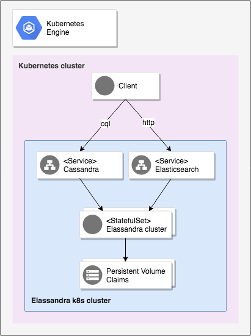

# Elassandra Google k8s Marketplace


This repository contains instructions and files necessary for running [Elassandra](https://github.com/strapdata/elassandra) via 
[Google's Hosted Kubernetes Marketplace](https://console.cloud.google.com/marketplace/browse?filter=solution-type:k8s).

# Overview

As shown in the following figure, Elassandra nodes are deployed as a kubernetes statefulset, and expose two kubernetes services, one for Apache Cassandra, one for Elasticsearch.



# Using the build tools

## Setup the GKE environment

See `setup-k8s.sh` for instructions.
These steps are only to be followed for standing up a new testing cluster for the purpose of testing the code in this repo.


## Build the container images

The make task `app/build` is used to build two container images :
* a deployer that transforms our Elassandra helm chart into a GKE manifest
* an Elassandra image.

```
export TAG=6.2.3.8
make app/build
```

## Install the application

The make task `app/install` simulates a google marketplace environment and deploys the elassandra application.

```
make app/install
```

Once deployed, the application will appears on the google cloud console.

To stop/delete, use the make tasks `make app/uninstall`. You also need to delete the pvc : 
```bash
make app/uninstall
for i in 0 1 2; do
  kubectl delete pvc data-$NAME-$i
done
```

## Configure the application

The `schema.yml` file contains parameters available to the GKE end-user.

In order to specify values for these parameters, you can either defines environment variables or edit the head of the `Makefile`:
```Makefile
APP_PARAMETERS ?= { \
  "name": "$(NAME)", \
  "namespace": "$(NAMESPACE)", \
  "image.name": "$(APP_MAIN_IMAGE)" \
}
```

For instance if you wish to increase the disk size :
```Makefile
APP_PARAMETERS ?= { \
  "name": "$(NAME)", \
  "namespace": "$(NAMESPACE)", \
  "image.name": "$(APP_MAIN_IMAGE)" \
  "persistence.size": "512Gi" \
}
```

## Running Tests

```
make app/verify
```

That `app/verify` target, like many others, is provided for by Google's
marketplace tools repo; consult app.Makefile in that repo for full details. 

# Getting started with Elassandra

## Set env variables according to your cluster

Set the following environment variables according to your deployment:
```bash
export NAMESPACE=default
export APP_INSTANCE_NAME=elassandra-1
export ELASSANDRA_POD=$(kubectl get pods -n $NAMESPACE -l app=elassandra,release=$APP_INSTANCE_NAME -o jsonpath='{.items[0].metadata.name}')
```

## Accessing Cassandra

Check your cassandra cluster status by running the following command :
```shell
kubectl exec "$ELASSANDRA_POD" --namespace "$NAMESPACE" -c elassandra -- nodetool status
```

Connect to Cassandra using cqlsh:
```shell
kubectl exec -it "$ELASSANDRA_POD" --namespace "$NAMESPACE" -c elassandra -- cqlsh
```

## Accessing Elasticsearch

Check Elasticsearch cluster state and list indices:
```
kubectl exec -it "$ELASSANDRA_POD" --namespace "$NAMESPACE" -c elassandra -- curl http://localhost:9200/_cluster/state?pretty
kubectl exec -it "$ELASSANDRA_POD" --namespace "$NAMESPACE" -c elassandra -- curl http://localhost:9200/_cat/indices?v
```

Add a JSON document:
```
kubectl exec -it "$ELASSANDRA_POD" --namespace "$NAMESPACE" -c elassandra -- curl -XPUT -H "Content-Type: application/json" http://localhost:9200/test/mytype/1 -d '{ "foo":"bar" }'
```

## Accessing Elassandra using the headless service

A headless service creates a DNS record for each elassandra pod. For instance :
```
$ELASSANDRA_POD.$APP_INSTANCE_NAME.default.svc.cluster.local
```

Clients running inside the same k8s cluster could use thoses records to access both CQL, ES HTTP, ES transport, JMX and thrift protocols.

## Accessing Elassandra with port forwarding

You could also use a local proxy to access the service.

Run the following command in a separate background terminal:
```shell
kubectl port-forward "$ELASSANDRA_POD" 9042:9042 9200:9200 --namespace "$NAMESPACE"
```

In you main terminal (requires curl and cqlsh commands):
```shell
curl localhost:9200
cqlsh --cqlversion=3.4.4
```

## Deploying Kibana (requires helm installed)

Start a Kibana pod with the same Elasticsearch version as the one provided by Elassandra. By default, Kibana connects to the Elasticsearch service on port 9200.

```
helm install --namespace "$NAMESPACE" --name kibana --set image.tag=6.2.3 --set service.externalPort=5601 stable/kibana
```

To delete Kibana :
```
helm delete kibana --purge
```

## Deploying Filebeat

Elassandra can be used beside Filebeat and Kibana to monitor k8s logs :
```
kubectl create -f extra/filebeat-kubernetes.yaml
```

Open Kibana to see the logs flowing to Elassandra :
```
export POD_NAME=$(kubectl get pods --namespace default -l "app=kibana,release=kibana" -o jsonpath="{.items[0].metadata.name}")
echo "Visit http://127.0.0.1:5601 to use Kibana"
kubectl port-forward --namespace default $POD_NAME 5601:5601
```

To delete Filebeat :
```
kubectl delete -f extra/filebeat-kubernetes.yaml
```